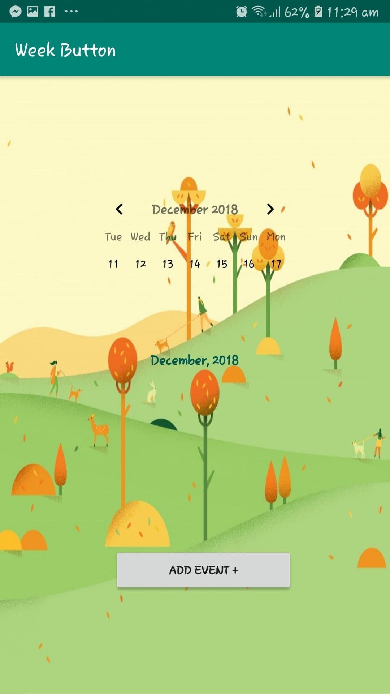

# FinalWeekButton
This is The Final view For my project I just need to connect the Database folder with it and I am done.

In order to run it Download Android Studio Canary version. My product version was 3.4.0AI-183.4588.61.34.5173923 
Download the Zip folder of codes from here extract it
Install android studio and open the projec with it

 
